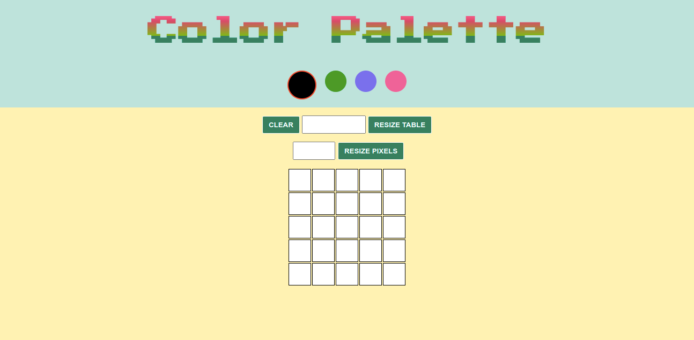

# Pixel Art Project
This is my first deployable project. I did it while I was starting my studies on the Fundamentals of Web Development in the Trybe course.

## Live Link
<a href="https://pixels-art-project.netlify.app">Pixel Art</a>
  
## Screenshot

## My Goals
* Create color palette with 4 colors, black as first (pre-selected) and three others randomly generated;
* Create a board measuring 5x5;
* Paint each pixel on click with the selected color;
* Create a clean up button;
* Create an input to change the size of the board (between 5 and 50 pixels);
* Create an input to change dimensions of the pixels.

## Used Technologies
  * HTML
  * CSS
  * Javacript
  * DOM
  * Semantic HTML

## How to use it
  Just go to the page, configure the size of the board and the size of the pixels, select the color and have fun.
   
  Tip: If you refresh the page the colors will change (except black) and you will be able to color diferent things.
